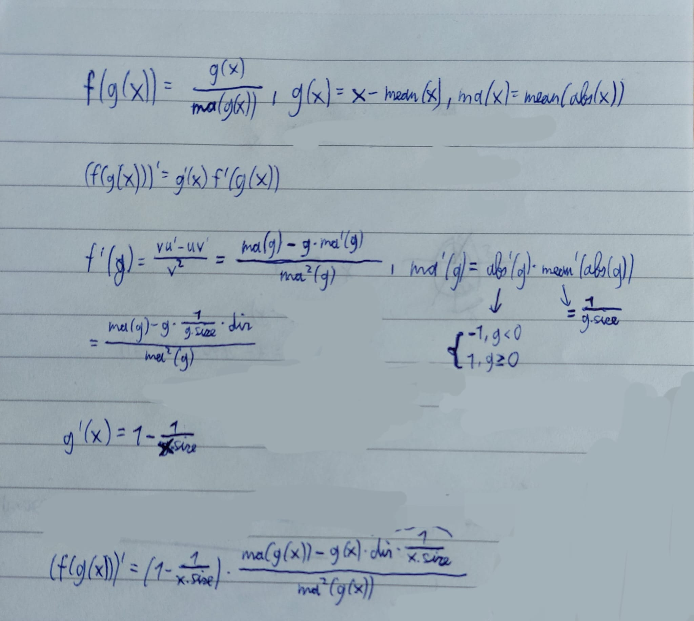

# TrashGrad (Don't use it!)

I dont know how to write a readme lol. It's absolute garbage (inefficient af). I might use numba, cupy and cuSignal in the future to make it a
somewhat reasonable implementation and speed it up. Right now, I just defined a bunch of operations you can do on so-called Tensor objects
and the derivative of this operation with respect to whatever contributes to it will be set automatically as lambda functions in a dictionary that 
encorporate the local derivative. The keys are simply the result the operation yielded, so you could in theory use a Tensor in multiple threads at
the same time. Dont use it. It's garbage.

# Derivation of _f(grad) in Tensor.batchnorm()
Sorry for the bad editing, this is the original sheet I tried to derive it on myself. I removed a few things.

dir = abs'(g) forgot to add that
